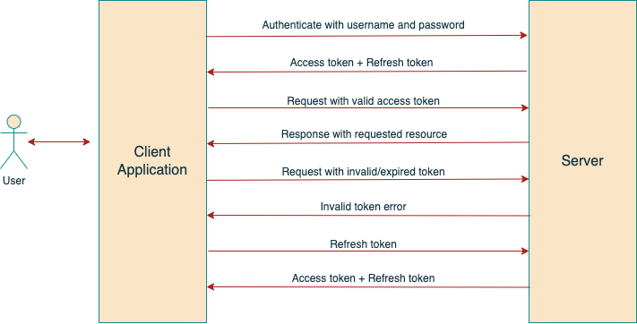

  

[circleci-image]: https://img.shields.io/circleci/build/github/nestjs/nest/master?token=abc123def456
[circleci-url]: https://circleci.com/gh/nestjs/nest

## Token-based Authentication

Users enter their username and password to obtain access token which allows them to fetch protected resources without using their credentials. Refresh token allows users to get a new access token once it's expired/invalidated. 

## Stack

- NestJS
- Typescript
- Docker
- MongoDB
- Swagger (link: base_url/api)
- JWT (access token, refresh token, Passport strategies)
- Redis
- Postman

## Test

User included Postman collection for testing and follow the above flow to obtain tokens, get access to protected resources, invalidate tokens, and use refresh token to get access token
